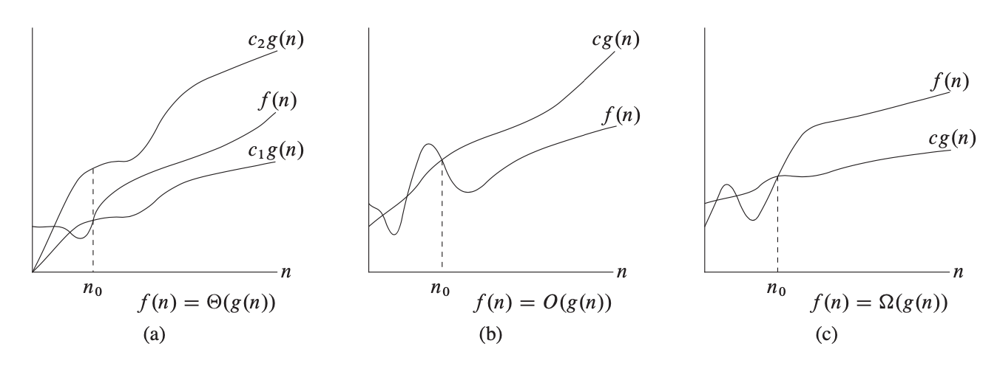

## Notes and Code for Data Structures and Algorithms（C++）

Author: Yang Shan, Department of Management Science and Engineering, Tongji University

Environment：Apple clang version 11.0.3 (clang-1103.0.32.59), Xcode 11.4.1

This repository contains code and my notes data structures and algorithms taught in Prof. Liang Zhe's class. Algorithms in file  [Final Exam Preparation&Algorithm](Final Exam Preparation&Algorithm) are achieved by myself, some of the other algorithms are adapted from nice code provided by others online and some are programmed by myself.

<u>My notes for these algorithms will be added to this file soon.</u>

- [Basic Knowledge](#basic-knowledge)
  * [Divide and Conquer](#divide-and-conquer)
  * [Time complexity](#time-complexity)
- [Sorting Algorithms](#sorting-algorithms)
  * [Buble Sort](#buble-sort)
  * [Merge Sort](#merge-sort)
  * [Bucket sort](#bucket-sort)
  * [Binary Tree](#binary-tree)
  * [Quick Sort](#quick-sort)
  * [Random Quick Sort](#random-quick-sort)
  * [Count Sort](#count-sort)
  * [Heap Sort](#heap-sort)
  * [Insertion Sort](#insertion-sort)
  * [Radix Sort](#radix-sort)
  * [Select Sort](#select-sort)
- [Data Structures](#data-structures)
  * [Binary Tree](#binary-tree-1)
  * [Linked List](#linked-list)
  * [Double Linked List](#double-linked-list)
  * [Queue and Stack](#queue-and-stack)
  * [Hash Table](#hash-table)
  * [Red Black Tree](#red-black-tree)
  * [Linear Table](#linear-table)
- [Graph Algorithms](#graph-algorithms)
  * [BFS](#bfs)
  * [DFS](#dfs)
  * [Graph Search](#graph-search)
  * [Min Heapify](#min-heapify)
  * [All pairs shortest paths](#all-pairs-shortest-paths)
  * [Bellman Ford](#bellman-ford)
  * [Dijkstra](#dijkstra)
  * [DAG Shortest Path](#dag-shortest-path)
  * [Floyd Warshall](#floyd-warshall)
  * [Topology](#topology)
  * [Tarjan](#tarjan)
  * [MST](#mst)

## Basic Knowledge

### Divide and Conquer

The best example for divide and conquer is [merge sort](#merge-sort) which divides a large sorting problem into some small compare problems. This algorithm is robust and quick.

### Time complexity

For example, quick sort's average time complexity is Θ(nlgn) and the worest case O(n^2).

## Sorting Algorithms

### Buble Sort

Source Code: [Buble Sort](./Part1-Sorting-Algorithms)

### Merge Sort

Source Code: [Merge Sort](./Part1-Sorting-Algorithms)

### Bucket sort

Source Code: [Bucket Sort](./Part1-Sorting-Algorithms)

### Binary Tree

Source Code: [Binary Sort](./Part1-Sorting-Algorithms)

### Quick Sort

Source Code: [Quick Sort](./Part1-Sorting-Algorithms)

### Random Quick Sort

Source Code: [Random Quick Sort](./Part1-Sorting-Algorithms)

### Count Sort

Source Code: [Count Sort](./Part1-Sorting-Algorithms)

### Heap Sort

Source Code: [Heap Sort](./Part1-Sorting-Algorithms)

### Insertion Sort

Source Code: [Insertion Sort](./Part1-Sorting-Algorithms)

### Radix Sort

Source Code: [Radix Sort](./Part1-Sorting-Algorithms)

### Select Sort

Source Code: [Select Sort](./Part1-Sorting-Algorithms)

## Data Structures

### Binary Tree

Source Code：[Binary Tree](Part2-Data-Structures)

### Linked List

Source Code：[Linked List](Part2-Data-Structures)

### Double Linked List

Source Code：[Double Linked List](Part2-Data-Structures)

### Queue and Stack

Source Code：[Queue and Stack](Part2-Data-Structures)

### Hash Table

Source Code：[Hash Table](Part2-Data-Structures)

### Red Black Tree

Source Code：[Red Black Tree](Part2-Data-Structures)

### Linear Table

Source Code：[Linear Table](Part2-Data-Structures)

## Graph Algorithms

### BFS

Source Code：[BFS](Part3-Graph-Algorithm)

### DFS

Source Code：[DFS](Part3-Graph-Algorithm)

### Graph Search

Source Code：[Graph Search](Part3-Graph-Algorithm)

### Min Heapify

Source Code：[Min Heapify](Part3-Graph-Algorithm)

### All pairs shortest paths

Source Code：[All pairs shortest paths](Part3-Graph-Algorithm)

### Bellman Ford

Source Code：[Bellman Ford](Part3-Graph-Algorithm)

### Dijkstra

Source Code：[Dijkstra](Part3-Graph-Algorithm)

### DAG Shortest Path

Source Code：[DAG Shortest Path](Part3-Graph-Algorithm)

### Floyd Warshall

Source Code：[Floyd Warshall](Part3-Graph-Algorithm)

### Topology

Source Code：[Topology](Part3-Graph-Algorithm)

### Tarjan

Source Code：[Tarjan](Part3-Graph-Algorithm)

### MST

Source Code：[MST](Part3-Graph-Algorithm)

